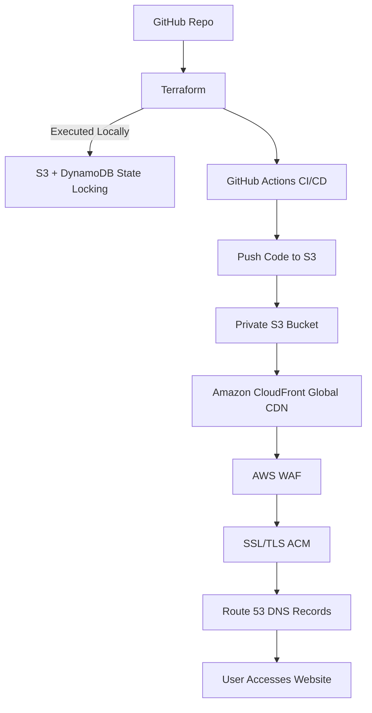
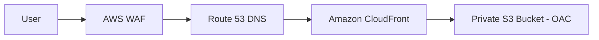

# Rishi Majmudar | Cloud Architect & Portfolio

[](https://aws.amazon.com/certification)
[](https://react.dev/)
[](https://tailwindcss.com/)
[](https://vitejs.dev/)
[](https://github.com/features/actions)

## 🌟 Overview

Welcome to the repository of my professional portfolio. As an **AWS Certified Solutions Architect**, I built this site to serve as both a digital resume and a live demonstration of cloud-native architecture. 

This project showcases a modern, high-performance web application built with **React 19** and **Tailwind CSS 4.0**, deployed on **AWS** using a fully automated **DevOps pipeline**.

### 🔗 Live Demo
- **Portfolio:** [portfolio.rishimajmudar.me](https://portfolio.rishimajmudar.me)

---

## 🛠 Tech Stack

### Frontend
- **React 19:** Utilizing the latest React features for efficient UI rendering and state management.
- **Vite:** High-performance build tool for modern web projects.
- **Tailwind CSS 4.0:** Advanced utility-first CSS framework for a premium, custom-designed interface.
- **Framer Motion:** High-fidelity animations and micro-interactions for an engaging user experience.
- **Lucide React:** A clean and consistent iconography system.

### Infrastructure & DevOps (AWS)
- **Amazon S3:** Optimized static website hosting for cost-efficiency and durability.
- **Amazon CloudFront:** Global Content Delivery Network (CDN) with edge caching for lightning-fast delivery.
- **AWS Certificate Manager (ACM):** SSL/TLS encryption for secure HTTPS communication.
- **GitHub Actions:** Fully automated CI/CD pipeline for building and deploying to AWS on every push.
- **IAM OIDC:** Secure, secret-less authentication between GitHub Actions and AWS.

---

## 🏗 Architecture & Infrastructure

### 🚀 Infrastructure & Deployment Flow
The infrastructure is provisioned using **Terraform** with state-locking managed by **Amazon S3** and **DynamoDB**. The deployment is fully automated via **GitHub Actions**.



### 🌐 User Runtime Traffic
Secure and optimized traffic flow from the end-user to the static content hosted on S3.



### 🧱 Core Components

-   **Terraform (IaC):** Manages the entire AWS lifecycle. Uses S3 for state storage and DynamoDB for state locking to prevent concurrent modifications.
-   **GitHub Actions:** Handles the CI/CD pipeline, building the React app and syncing the production build to S3.
-   **Amazon S3:** Hosts the static website files. Public access is disabled, and content is served exclusively through CloudFront.
-   **Amazon CloudFront:** Acts as a global CDN, caching content at edge locations to minimize latency. Integrated with **Origin Access Control (OAC)** for secure S3 access.
-   **AWS WAF:** Protects the application from common web exploits and bots.
-   **Route 53:** AWS's highly available DNS service, routing traffic to the CloudFront distribution.
-   **ACM (SSL/TLS):** Provides secure HTTPS communication via automated certificate management.

---
## 🏗 Key Features for Recruiters

1.  **Cloud-Native Architecture:** Demonstrates real-world usage of AWS services (S3, CloudFront, Route 53).
2.  **Modern Frontend Development:** Clean, modular React code focusing on performance and responsiveness.
3.  **CI/CD Maturity:** Every change is automatically built, optimized, and deployed to production.
4.  **Premium UX:** Custom-built components with smooth transitions and a mobile-first approach.

---

## 🚀 Projects Showcased (in Portfolio)

- **Secure Cloud Architecture:** S3 Static Hosting, CloudFront, WAF, and Route 53.
- **Automated CI/CD Pipelines:** GitHub Actions, Docker, and EC2 deployment workflows.
- **Distributed Monitoring:** Fault-tolerant systems with Load Balancing and Replication.
- **E-Commerce System:** Full-stack development with PHP, MySQL, and session logic.

---

## 💻 Local Development

1.  **Clone & Install:**
    ```bash
    git clone https://github.com/Rishi-Cs-ms/rishimajmudar.me.git
    cd rishi-portfolio
    npm install
    ```

2.  **Run Development Server:**
    ```bash
    npm run dev
    ```

3.  **Production Build:**
    ```bash
    npm run build
    ```

---

## ✉️ Contact Information

- **Name:** Rishi Majmudar
- **Role:** Cloud Architect / AWS Certified Solutions Architect
- **Email:** [rishimajmudar@gmail.com](mailto:rishimajmudar@gmail.com)
- **Location:** Ottawa, Canada
- **LinkedIn:** [linkedin.com/in/rishi-majmudar](https://linkedin.com/in/rishi-majmudar)
- **GitHub:** [github.com/Rishi-Cs-ms](https://github.com/Rishi-Cs-ms)

---
*Created with ❤️ by Rishi Majmudar*
