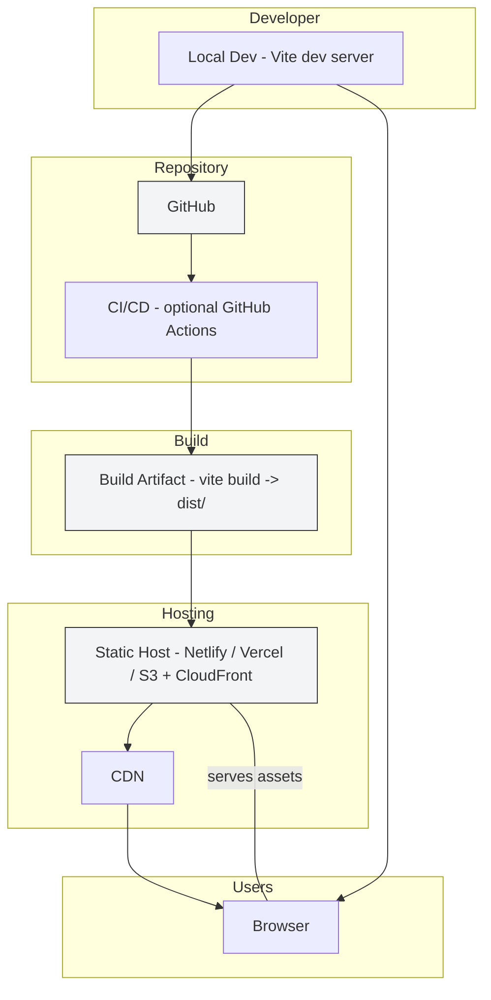

# rishi-portfolio

A small, fast portfolio site built with Vite and React. This repository contains the source for a single-page portfolio that serves static assets and is optimized for modern static hosting providers.

**Architecture**


```mermaid
flowchart TB
	subgraph Dev[Developer]
		A["Local Dev - Vite dev server"]
	end

	subgraph Repo[Repository]
		B["GitHub"]
		C["CI/CD - optional GitHub Actions"]
	end

	subgraph Build[Build]
		D["Build Artifact - vite build -> dist/"]
	end

	subgraph Hosting[Hosting]
		E["Static Host - Netlify / Vercel / S3 + CloudFront"]
		F["CDN"]
	end

	subgraph Client[Users]
		G["Browser"]
	end

	A --> B
	B --> C
	C --> D
	D --> E
	E --> F
	F --> G
	A --> G
	E ---|serves assets| G

	classDef infra fill:#f3f4f6,stroke:#333,stroke-width:1px;
	class D,E,B infra;
```

**Overview**

- **Framework**: React + Vite
- **Languages**: JavaScript, CSS
- **Purpose**: Personal portfolio to showcase projects, blog links, and contact information

**Repository structure**

- `index.html` — app entry
- `src/` — React source
- `src/main.jsx` — app bootstrap
- `src/App.jsx` — main app component
- `src/index.css` — global styles
- `public/` — static assets
- `package.json` — scripts & dependencies

**Getting started (local)**

Install dependencies:

```bash
npm install
```

Start dev server:

```bash
npm run dev
```

Build for production:

```bash
npm run build
```

Preview production build locally:

```bash
npm run preview
```

**Deployment**

This is a static site; build output in `dist/` can be deployed to any static host. Common options:

- Netlify / Vercel — automatic deploys from GitHub
- GitHub Pages — serve from `gh-pages`
- AWS S3 + CloudFront — static site with CDN

CI/CD (optional): Add a GitHub Actions workflow that runs `npm ci && npm run build` and deploys the `dist/` folder to your chosen host.

**Notes & next steps**

- Add meta tags and SEO enhancements in `index.html`.
- Add structured data for projects and contact info.
- Connect a CI workflow for automated deployments.

**License**

MIT — feel free to reuse and adapt.

